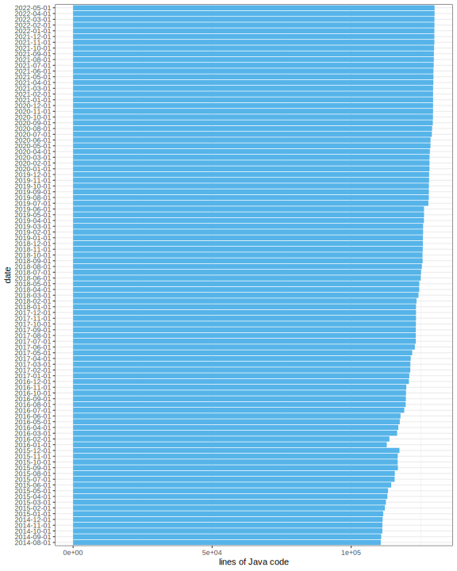

# Lines of Code

The lines of code as a function of time (per month) in the last 5 years.

## BEAST 2 core



## BEAST 2 packages

TODO


# Pipeline

```bash
cd ~/WorkSpace/beast2stats
# save code stats to *.txt in tmp-yyyy-mm-dd
./createStats.sh

# create *.svg in figures
Rscript beast2Stats.R
```

