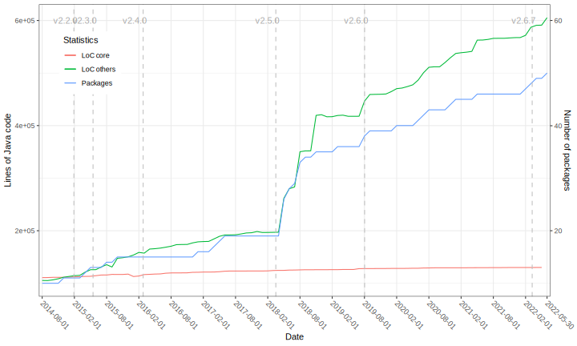
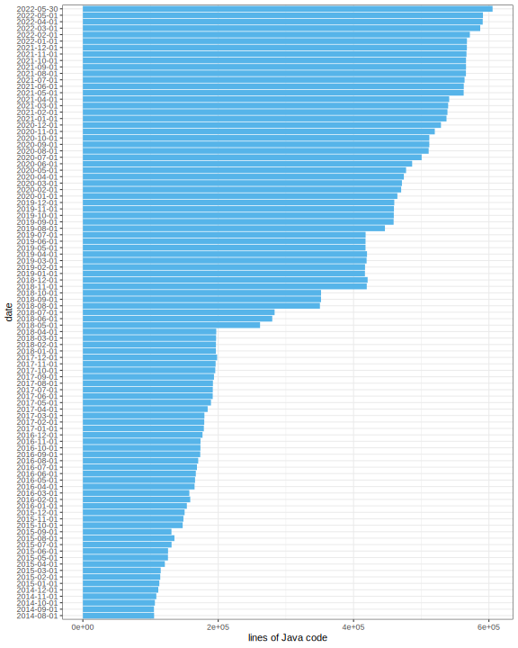

## Basic statistics

Do you know how the BEAST 2 project was going in the last 5 years? 

Here is the answer:



The three lines are:
1. the lines of Java code of BEAST 2 core as a function of time (per month) in the last 5 years;
2. the lines of Java code of other packages excluding BEAST 2 core as a function of time (per month) in the last 5 years;
3. the number of other packages created during the period.

The vertical lines are major releases of BEAST 2 core.

The data was collected at the first day of each month. 
But there were two packages not included in this summary because the source code was not available by then.

## The detail

### BEAST 2 core 


### Other packages excluding BEAST 2 core

The released packages in [CBAN for BEAST 2.5](https://github.com/CompEvol/CBAN/raw/master/packages2.5.xml) 
were chosen in this summary.
The livetime summary of all BEAST 2 packages are also available from BEAST 2 
[Package Viewer](https://compevol.github.io/CBAN/).

Because the first release date of packages was not easy to access, 
I used the date of the first commit in each repository in this summary.

The bar charts:




The 3D interactive view is also [available](https://walterxie.github.io/beast2stats/3d) using Safari or Chrome.


## Pipeline

```bash
# source code has to be ready before analysis
cd ~/WorkSpace
git clone https://github.com/CompEvol/beast2.git
ls

# check out beast2stats project
git clone https://github.com/walterxie/beast2stats.git

# start pipeline
cd ~/WorkSpace/beast2stats
# save code stats to *.txt in tmp-yyyy-mm-dd
PACKAGE="beast2"
./createStats.sh $PACKAGE

# create *.svg in figures
Rscript beast2Stats.R
```

